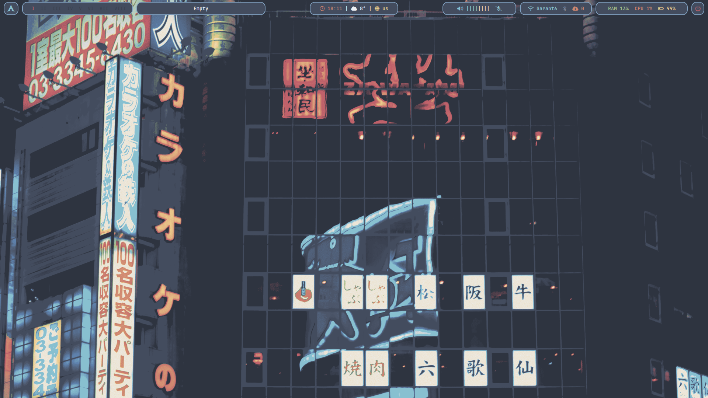
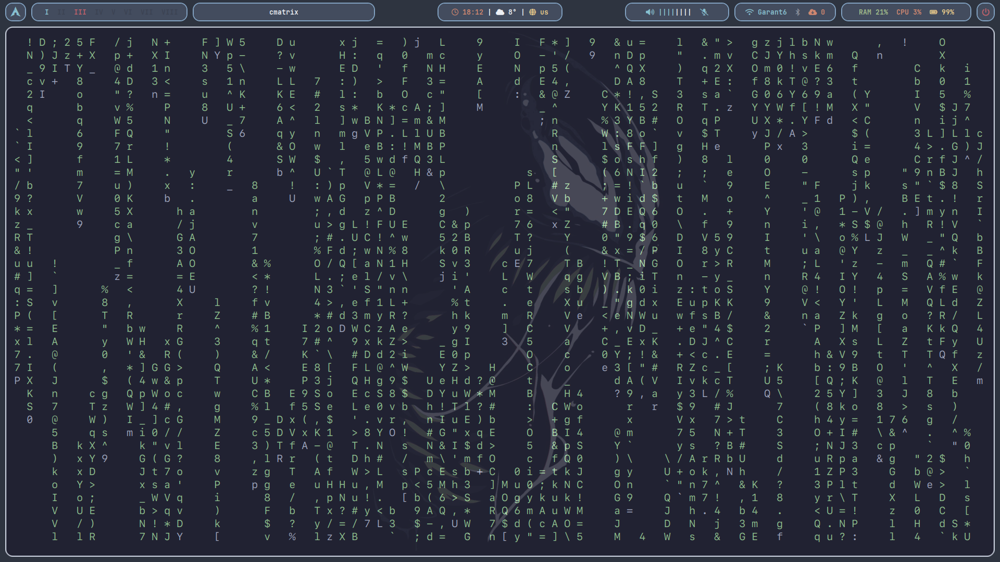

# Dotfiles For Arch Linux System
This is my configuration for **Arch Linux**. Made in Nord style. Looks pretty and comfortable to use.

# Used Staff
1) [BSPWM](https://wiki.archlinux.org/title/Bspwm). Tiling window manager that represents windows as the leaves of a full binary tree
2) [Polybar](https://wiki.archlinux.org/title/Polybar). Fast and easy-to-use tool for creating status bars
3) [Alacritty](https://wiki.archlinux.org/title/Alacritty). Simple, GPU-accelerated terminal emulator
4) [Dunst](https://wiki.archlinux.org/title/Dunst). Lightweight replacement for the notification-daemons
5) [Rofi](https://wiki.archlinux.org/title/Rofi). Window switcher
6) [Picom](https://wiki.archlinux.org/title/Picom). Standalone compositor for window managers
7) [Nitrogen](https://wiki.archlinux.org/title/Nitrogen). Fast and lightweight desktop background browser

# Screenshots

# Inspired By

https://notabug.org/owl410/owl_dotfiles